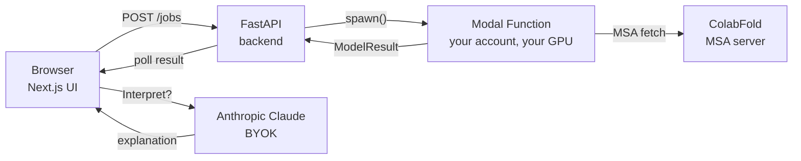

[English](README.md) | **日本語**

> 📖 **このページは英語版 README の翻訳です。** 正本 (canonical) は英語版 [`README.md`](README.md) です。最新情報や詳細は英語版を参照してください。日本語版は概要を素早く把握するためのものとして維持しています。

# EasyFold

> **AlphaFold 3 の予測結果を Claude に聞こう。**

[](LICENSE)
[](https://huggingface.co/spaces/maiko811/easyfold-demo)
[](#モデルの選択)

> ⚠️ **研究用ツールです — 医療・診断・臨床用途には使用できません。** EasyFold は探索的構造生物学のための MVP です。予測は計算上の仮説であり、いかなる臨床基準にも検証されていません。患者ケアや規制関連の提出には使用しないでください。


> **Build (組み立て)** — クリック操作だけで、リガンドと翻訳後修飾を含むマルチチェーン アセンブリを構築できます。JSON 不要。


> **Predict (予測)** — あなたの配列はあなた自身の Modal GPU で実行されます。約 30 秒〜数分で完了。mmCIF と confidence チャートはブラウザで描画されます。


> **Interpret (解釈)** — 自分の [Anthropic API キー](https://console.anthropic.com/) を持参して構造に関する質問を投げると、Claude が実際の pLDDT / PAE / ipTM の値に基づいた回答を返します。

---

## EasyFold とは

EasyFold は、[AlphaFold 3](https://github.com/google-deepmind/alphafold3) と [Boltz-2](https://github.com/jwohlwend/boltz) のタンパク質構造予測を、**コードを書けない実験系研究者でも使えるようにする Web UI** です。

配列を貼り付ける (もしくは UniProt アクセッション / PDB ID で検索する)、リガンドや修飾があれば追加する、**Predict** ボタンを押す — それだけで 5〜15 分後に 3D 構造、残基ごとの confidence (pLDDT)、ペアワイズ アラインメント エラー (PAE)、そして他のツールにはない特徴として「これらの数値が *あなたの研究にとって* 何を意味するか」の自然言語による解説が得られます。

**既存のラッパー ([AFusion](https://github.com/Hanziwww/AlphaFold3-GUI)、[Tamarind Bio](https://www.tamarind.bio/)、[AlphaFold Server](https://alphafoldserver.com/)) と違う 3 つの点:**

- **質問駆動の入力。** ユーザーは「タンパク質、リガンド、修飾、コピー数」という研究者の言葉で考えます。AF3 の JSON スキーマを意識する必要はありません。Assembly Builder UI が裏側で適切な仕様に変換します。
- **LLM 解釈レイヤー。** 「この DNA 結合ポケットは docking に使える信頼性か?」のような質問に対し、Claude が実際の pLDDT / PAE / ipTM の数値に基づいた回答と、次のアクションの提案を返します。
- **1 つの UI で 2 つのモデル。** ジョブごとに AlphaFold 3 (CC-BY-NC-SA、最高品質のリファレンス) と Boltz-2 (MIT、Google 承認不要) を選べます。同じ入力形式、同じ結果ビューア。

EasyFold は **zero-hosting OSS** です。各ユーザーが自分の [Modal](https://modal.com/) アカウントにデプロイし、GPU の課金はそのユーザーから直接 Modal へ。私たち (運営側) はあなたの配列を一切目にしません。中央 EasyFold サービスに依存することもありません。

---

## デモを試す

**[→ huggingface.co/spaces/maiko811/easyfold-demo](https://huggingface.co/spaces/maiko811/easyfold-demo)**

インストール不要、GPU 不要、API キー不要 (Interpret パネルを試したい場合のみ、自分の [Anthropic API キー](https://console.anthropic.com/) が必要)。

デモには 3 つの事前計算済み構造 (**1TUP** — p53 の DNA 結合ドメイン、**1CRN** — クランビン、**6LU7** — SARS-CoV-2 メインプロテアーゼ) が含まれており、Mol\* ビューア、pLDDT / PAE confidence チャート、Claude 解釈パネルをすべて試せます。

> ℹ️ **デモの confidence 値は合成データです** — UI の動作確認用で、実際の予測値ではありません。自分の配列で実データを得るには、下のクイックスタートに従ってください。

---

## クイックスタート: 約 10 分で実予測を実行

高速パスは **Boltz-2** を使います (MIT ライセンス、Google 承認不要)。AlphaFold 3 のセットアップは [`modal/README.md`](modal/README.md) に記載 — Google からの weight アクセス承認に 2〜3 営業日かかるため、ここではメインで紹介しません。

### 前提条件

- macOS または Linux で [`uv`](https://docs.astral.sh/uv/)、[`pnpm`](https://pnpm.io/)、`git` が利用できること。
- 無料の [Modal アカウント](https://modal.com/) (無料枠で予測が数回試せます)。

### 手順

```bash
# 1. リポジトリを clone してセットアップ
git clone https://github.com/maikoo811/easyfold.git
cd easyfold
cd backend && uv sync
cd ../frontend && pnpm install
cd ..

# 2. Modal を認証 (ブラウザが開いて 30 秒程度)
cd backend && uv run modal setup
cd ..

# 3. Boltz-2 推論 Function を自分の Modal アカウントにデプロイ
./modal/deploy.sh boltz       # 初回デプロイはイメージビルドで 5-10 分

# 4. バックエンドを起動 (ターミナル 1)
cd backend && uv run uvicorn easyfold.main:app --reload

# 5. フロントエンドを起動 (ターミナル 2)
cd frontend && pnpm dev
```

`http://localhost:3000` を開き、タンパク質を検索 (p53 なら **P04637** で試せます)、**Predict with Boltz-2** をクリック。最初の予測は約 10 分 (cold start + MSA 取得 + 推論 + 約 2 GB の weight ダウンロードが Modal Volume cache に入る)。2 回目以降は任意の配列で 30 秒〜5 分です。

**AlphaFold 3 を使いたい場合?** より高品質なリファレンスモデルですが、CC-BY-NC-SA (アカデミック専用) で Google 承認が必要です。[`modal/README.md § AlphaFold 3`](modal/README.md#alphafold-3) の weight 申請 → アップロード → `./modal/deploy.sh af3` の流れを参照してください。

---

## アーキテクチャ

EasyFold は、2 つのクラウド GPU 推論 Function の前段にある薄い Web スタックです。重要なものは私たちのインフラには一切ありません — 重い計算はあなたの Modal アカウントで実行されます。



バックエンドは **stateless** です。ジョブは Modal の `FunctionCall.object_id` を URL トークンとして追跡されるため、データベースもなく、保守する job queue もなく、バックエンドの再起動を予測が survive します。詳細は [ADR 0004](docs/decisions/0004-jobs-api-modal-funcall-as-id.md) を参照。

詳細: [`docs/ARCHITECTURE.md`](docs/ARCHITECTURE.md) と [`docs/decisions/`](docs/decisions/) の ADR 群。

### あなたのマシンから外に出るデータ

EasyFold は zero-hosting で私たちはあなたのデータを目にしませんが、予測は依然としていくつかの第三者サービスにアクセスします。IP センシティブな配列を扱う前にこの表を確認してください:

| 送信先 | 送信される内容 | タイミング |
|---|---|---|
| **[api.colabfold.com](https://colabfold.mmseqs.com/)** (ColabFold mmseqs2 MSA サーバー) | **タンパク質配列**そのもの (1 文字アミノ酸表記) | 予測のたび — Boltz が `--use_msa_server` で MSA を取得します。 |
| **[rest.uniprot.org](https://www.uniprot.org/)** / **[data.rcsb.org](https://www.rcsb.org/)** | 入力した**アクセッション ID または PDB ID** (例: `P04637`, `1TUP`)。**配列は送信されません** — ID による検索のみ。 | UniProt / PDB lookup タブを使用した時のみ。 |
| **[api.anthropic.com](https://www.anthropic.com/)** | 予測の**統計サマリ** (平均 pLDDT、低 confidence 残基の割合、PAE パーセンタイル、pTM/ipTM) + あなたの質問テキスト + モデルの回答。**完全な配列や raw PAE 行列は送信されません。** 自分の [Anthropic API キー](https://console.anthropic.com/) を使用 — ブラウザメモリに保持されるのみ (永続化もバックエンド経由もありません)。 | **Interpret** ボタンをクリックした時のみ。 |

> ⚠️ **Anthropic キーについて**: ブラウザから `api.anthropic.com` に直接 POST します。つまり**ページ上で読み込まれる任意の JavaScript** がメモリ上のキーを読める可能性があります。実キーは**公式デプロイ** (このリポジトリの `main` ブランチ) か、`frontend/lib/llm/` と `frontend/components/interpretation/` を監査した fork でのみ入力してください。信頼できないデプロイには実キーを貼らないでください。

IP センシティブな配列を扱う場合、ColabFold ステップに注意が必要です。ColabFold mmseqs2 サーバーを自分でホストする (プロジェクトが Docker イメージを公開) のがサポートされた回避策です。

**もう 1 つ — ジョブ結果 URL は bearer secret です。** `/predict/{jobId}` URL を知る人は誰でも予測結果を閲覧できます。`jobId` は Modal の `FunctionCall.object_id` (約 131 ビットのエントロピー、推測不可) ですが、URL 自体を API トークンのように扱ってください: 結果が機微な場合、チャット、スクリーンショット、メールなどに貼らないでください。

セキュリティ報告: [`SECURITY.md`](SECURITY.md) を参照。

---

## モデルの選択

| 用途 | 推奨モデル | ライセンス | 最初の予測までの待ち時間 |
|---|---|---|---|
| とりあえず試したい (インストール不要) | 上の HF デモ | (事前計算済み) | 0 分 |
| アカデミック研究、最高品質のリファレンス | **AlphaFold 3** | CC-BY-NC-SA 4.0 (非商用) | 2〜3 日 (Google 承認待ち) + 10 分 |
| 商用利用、創薬、高速イテレーション | **Boltz-2** | MIT (商用 OK) | 〜10 分 (初回。以降は約 30 秒) |
| 翻訳後修飾 (PTM) のあるタンパク質を予測 | **AlphaFold 3** | CC-BY-NC-SA 4.0 | Boltz-2 は MVP で PTM を silently 落とすため、修飾がある場合は UI 側で無効化されます |

どのバケットにも当てはまらない場合: まずデモを試し、その後 Boltz-2 をデプロイしてください。1 つの午後で完結する経路です。

---

## ステータス

EasyFold は **MVP** です。エンドツーエンドのスタックは動作 (sequence → assembly → Modal → result + interpretation)、Assembly Builder はタンパク質 / リガンド / 修飾 / マルチチェーンをサポート、Boltz 経路は実走検証済み (Task 3.3 validation, p53 / P04637)。残タスク (open beta、Modal one-click deploy ボタン、Docker Compose self-host、bioRxiv application note) は [`docs/ROADMAP.md`](docs/ROADMAP.md) で管理しています。

---

## コントリビューション

ワークフロー規約は [`CLAUDE.md`](CLAUDE.md) に記載しています (元々 AI コーディングエージェント用ですが、人間にも適用されます):

- 1 PR / 1 関心。feature branch + rebase-merge。
- バックエンド: `uv` + `ruff` + `mypy --strict` + `pytest`。フロントエンド: `pnpm` + `tsc --noEmit` + `eslint`。
- 新しいアーキテクチャ決定は [`docs/decisions/`](docs/decisions/) に ADR として記録。
- タスクごとの長文ノートは [`docs/tasks/`](docs/tasks/) に ([`docs/TASK_TEMPLATE.md`](docs/TASK_TEMPLATE.md) をテンプレートとして使用)。

バグ報告、機能リクエスト、設計提案はすべて GitHub Issues で歓迎します。

---

## ライセンス

EasyFold の独自コード、ドキュメント、スクリーンショットは [**CC-BY-NC-SA 4.0**](LICENSE) — AlphaFold 3 のライセンスを継承 — の下でライセンスされています。実際に何を意味するかは、どの経路を実行するかによります:

| デプロイ形態 | AF3 非商用条項が適用? | 商用利用 OK? | Boltz-2 MIT 条項が適用? |
|---|---|---|---|
| **AF3 経路** (`easyfold-af3` を呼び出す) | **適用** — AlphaFold 3 weights から継承 | **No** (アカデミック利用のみ) | 未使用 |
| **Boltz-2 のみ** (`easyfold-boltz` のみ使用、`easyfold-af3` は呼ばない) | 非適用 (AF3 weights を一切ロードしない) | **Yes**、Boltz-2 の [MIT ライセンス](https://github.com/jwohlwend/boltz/blob/main/LICENSE) に従う | 適用 |
| **混在** (時に AF3、時に Boltz) | AF3 由来の予測出力はすべて非商用 | AF3 由来の出力は商用利用不可、Boltz 由来は可 | Boltz 出力に対して適用 |
| **EasyFold のソースコードとドキュメント** | — (本リポジトリはモデル derivative ではない) | CC-BY-NC-SA に基づき非商用のみ。Fork や改変は非商用なら OK。再配布には share-alike が必要。 | — |

商用デプロイの安全な経路は **Boltz-2 のみ**です。本表はガイダンスであり法的助言ではありません — 法務チームと確認してください。

> EasyFold 独自コードのライセンスについて: ユーザーが意図せず AF3 の非商用ラインを越えないよう、AF3 と同じ CC-BY-NC-SA を採用しました。コード自体はラッパーで、AF3 の weights やソースをバンドルしているわけではありません。Boltz-only 経路への商用ニーズが十分にあれば、wrapper code に対する dual-license (例: CC-BY-NC-SA + Apache-2.0) も検討対象です。必要な場合は issue を立ててください。

---

## 謝辞

- **[AlphaFold 3](https://github.com/google-deepmind/alphafold3)** (Google DeepMind) — EasyFold がラップするリファレンス構造予測モデル。
- **[Boltz-2](https://github.com/jwohlwend/boltz)** (Wohlwend et al., MIT) — 商用利用を可能にする MIT ライセンスの代替モデル。
- **[Mol\*](https://molstar.org/)** — 埋め込み 3D 構造ビューア。
- **[ColabFold](https://github.com/sokrypton/ColabFold)** (Mirdita et al.) — Boltz の `--use_msa_server` フラグ経由で利用する公開 mmseqs2 MSA サーバー。
- **[Modal](https://modal.com/)** — クラウド GPU ランナー。
- **[Anthropic Claude](https://www.anthropic.com/)** — Interpret パネルを支える LLM。
