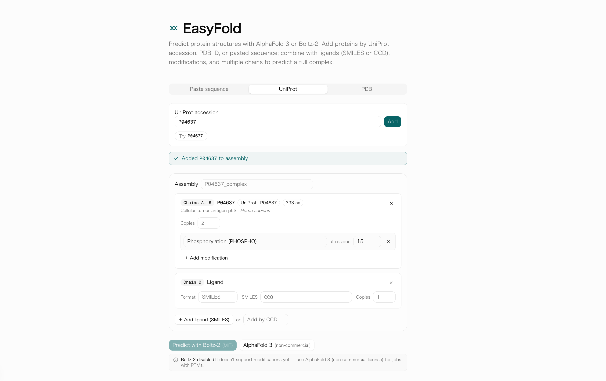
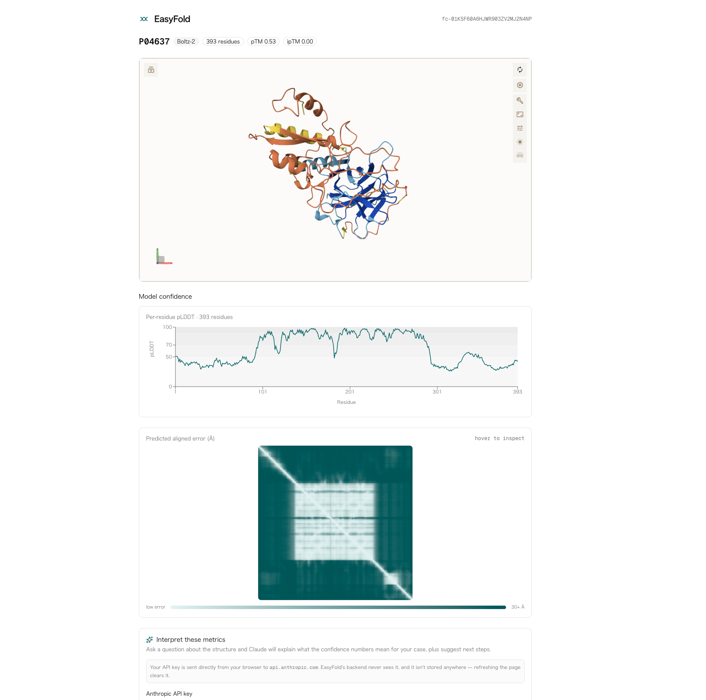
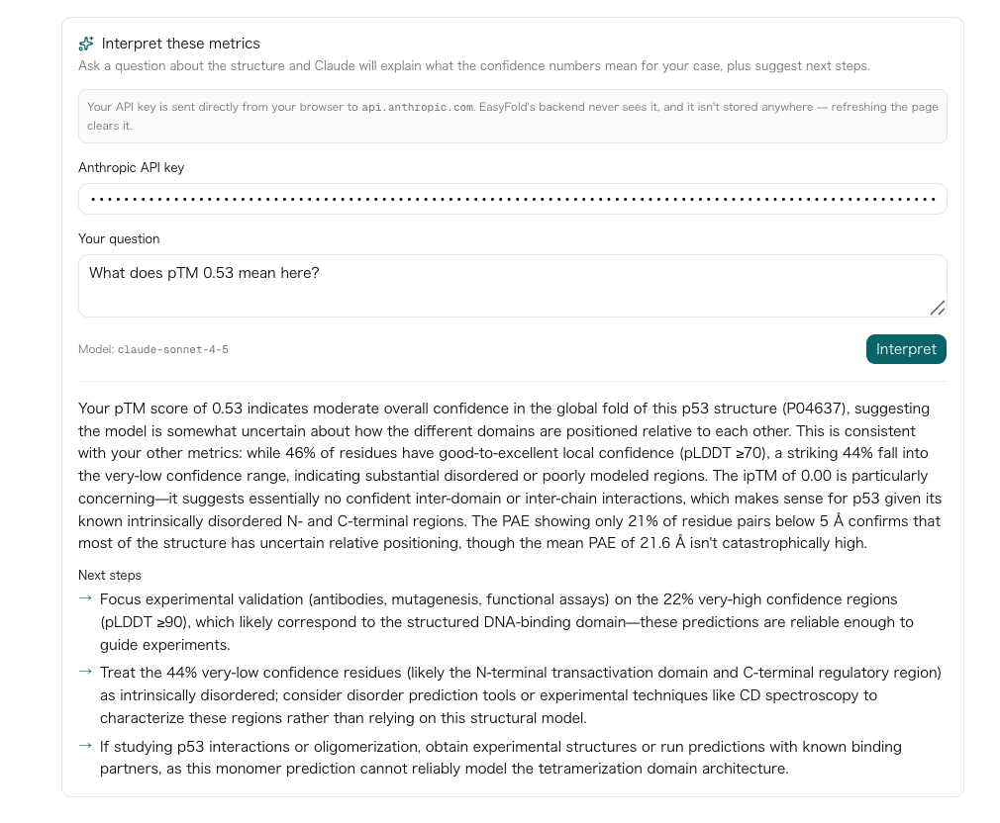
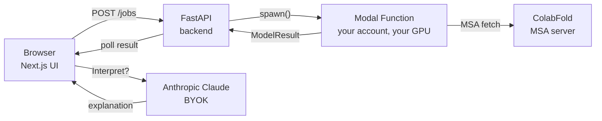

# EasyFold

> **Ask Claude what your AlphaFold 3 prediction means.**

[](LICENSE)
[](https://huggingface.co/spaces/maiko811/easyfold-demo)
[](#pick-a-model)

> ⚠️ **Research tool — not for medical, diagnostic, or clinical use.** EasyFold is an MVP for exploratory structural biology. Predictions are computational hypotheses, not validated against any clinical standard. Do not use to inform patient care or regulatory submissions.



> **Build** — point and click your way to a multi-chain assembly with ligands and post-translational modifications. No JSON.



> **Predict** — your sequence runs on your own Modal GPU. ~30 seconds to a few minutes. mmCIF + confidence charts render in the browser.



> **Interpret** — bring your own [Anthropic API key](https://console.anthropic.com/), ask a question about the structure, and Claude grounds the answer in the actual pLDDT / PAE / ipTM your prediction produced.

---

## What is EasyFold

EasyFold is a web UI that makes [AlphaFold 3](https://github.com/google-deepmind/alphafold3) and [Boltz-2](https://github.com/jwohlwend/boltz) protein structure prediction usable by experimental biologists who don't code.

You paste a sequence (or look it up by UniProt accession / PDB ID), add ligands and modifications if you have them, click **Predict**, and 5–15 minutes later you get a 3D structure, per-residue confidence (pLDDT), pairwise alignment error (PAE), and — uniquely — a natural-language explanation of what those numbers mean for *your* question.

**Three things that make EasyFold different from existing wrappers ([AFusion](https://github.com/Hanziwww/AlphaFold3-GUI), [Tamarind Bio](https://www.tamarind.bio/), [AlphaFold Server](https://alphafoldserver.com/)):**

- **Question-driven input.** You think in proteins, ligands, modifications, and copies — not in AF3's JSON schema. The assembly builder UI maps your scientific question to the underlying spec.
- **LLM interpretation layer.** Ask "Is this DNA-binding pocket trustworthy enough for docking?" and Claude answers in plain English, grounded in the actual pLDDT / PAE / ipTM numbers your prediction produced, with concrete next-step suggestions.
- **Two models behind one UI.** Pick AlphaFold 3 (CC-BY-NC-SA, highest reference quality) or Boltz-2 (MIT, no Google approval needed) per job. Same input shape, same result viewer.

EasyFold is **zero-hosting OSS**: you deploy to your own [Modal](https://modal.com/) account, your GPU bills go to you, we never see your sequences. There's no central EasyFold service to depend on.

---

## Try the demo

**[→ huggingface.co/spaces/maiko811/easyfold-demo](https://huggingface.co/spaces/maiko811/easyfold-demo)**

No install, no GPU, no API key needed (unless you want to try the Interpret panel — that's bring-your-own [Anthropic API key](https://console.anthropic.com/)).

The demo shows three pre-computed structures (**1TUP** — p53 DNA-binding domain, **1CRN** — crambin, **6LU7** — SARS-CoV-2 main protease) with the Mol\* viewer, pLDDT / PAE confidence charts, and the Claude interpretation panel.

> ℹ️ **Demo confidence values are synthetic** — they showcase the UI, not the predictions. For real numbers on your own sequences, follow the Quickstart below.

---

## Quickstart: run real predictions in ~10 minutes

The fast path uses **Boltz-2** (MIT license, no Google approval). AlphaFold 3 setup is documented in [`modal/README.md`](modal/README.md) — it takes 2–3 business days for Google to approve weight access, so we don't lead with it here.

### Prerequisites

- macOS or Linux with [`uv`](https://docs.astral.sh/uv/), [`pnpm`](https://pnpm.io/), and `git`.
- A free [Modal account](https://modal.com/) (their free tier covers a few predictions).

### Steps

```bash
# 1. Clone + install
git clone https://github.com/maikoo811/easyfold.git
cd easyfold
cd backend && uv sync
cd ../frontend && pnpm install
cd ..

# 2. Authenticate Modal (opens a browser, ~30 sec)
cd backend && uv run modal setup
cd ..

# 3. Deploy the Boltz-2 inference Function to YOUR Modal account
./modal/deploy.sh boltz       # first deploy builds the image, ~5-10 min

# 4. Start backend (terminal 1)
#    EASYFOLD_CORS_ORIGINS is required — empty by default for safety.
cd backend && \
  EASYFOLD_CORS_ORIGINS=http://localhost:3000,http://localhost:3001 \
  uv run uvicorn easyfold.main:app --reload

# 5. Start frontend (terminal 2)
cd frontend && pnpm dev
```

Open `http://localhost:3000`, look up a protein (try **P04637** for p53), and click **Predict with Boltz-2**. Your first prediction takes ~10 minutes (cold start + MSA fetch + inference + ~2 GB weight download into your Modal Volume cache). Subsequent predictions of any sequence take 30 seconds to 5 minutes.

**Want AlphaFold 3 instead?** It's the higher-quality reference model but it's CC-BY-NC-SA (academic use only) and requires Google's approval. Follow [`modal/README.md` § AlphaFold 3](modal/README.md#alphafold-3) for the weight-request → upload → `./modal/deploy.sh af3` flow.

---

## Architecture

EasyFold is a thin web stack in front of two cloud-GPU inference Functions. Nothing important lives in our infrastructure — the heavy compute runs in your Modal account.



The backend is **stateless** — jobs are tracked by Modal's `FunctionCall.object_id` as the URL token, so there's no database, no job queue we maintain, and predictions survive backend restarts. See [ADR 0004](docs/decisions/0004-jobs-api-modal-funcall-as-id.md) for the rationale.

Deeper detail: [`docs/ARCHITECTURE.md`](docs/ARCHITECTURE.md) and the [`docs/decisions/`](docs/decisions/) ADRs.

### What leaves your machine

EasyFold is zero-hosting and we never see your data, but a prediction still reaches a few third parties. Worth scanning the table before you run anything IP-sensitive:

| Destination | What's sent | When |
|---|---|---|
| **[api.colabfold.com](https://colabfold.mmseqs.com/)** (ColabFold mmseqs2 MSA server) | Your **protein sequence** (one-letter amino acids) | On every prediction — Boltz fetches the MSA via `--use_msa_server`. |
| **[rest.uniprot.org](https://www.uniprot.org/)** / **[data.rcsb.org](https://www.rcsb.org/)** | The **accession or PDB ID** you typed (e.g. `P04637`, `1TUP`). **No sequence is sent** — the lookup is by ID. | Only when you use the UniProt / PDB lookup tabs. |
| **[api.anthropic.com](https://www.anthropic.com/)** | The prediction's **summary stats** (mean pLDDT, % low-confidence, PAE percentiles, pTM/ipTM) + your free-text question + the model's reply. **No full sequence or raw PAE matrix is sent.** Your own [Anthropic API key](https://console.anthropic.com/) — held only in browser memory (never persisted, never relayed through our backend). | Only when you click **Interpret**. |

> ⚠️ **About the Anthropic key**: your browser POSTs directly to `api.anthropic.com`. That means *any JavaScript that loads on the page* could read the key while it's in memory. Only enter your key on the **official deployment** (this repo's `main` branch) or on a fork whose `frontend/lib/llm/` and `frontend/components/interpretation/` you've audited. Don't paste a real key into a random untrusted deployment.

If you're handling IP-sensitive sequences, the ColabFold step is the one to scrutinize. Self-hosting a ColabFold mmseqs2 server (the project publishes the Docker image) is the supported escape hatch.

**One more thing — job result URLs are bearer secrets.** Anyone with the `/predict/{jobId}` URL can read the prediction. The `jobId` is Modal's `FunctionCall.object_id` (~131 bits of entropy, unguessable) but treat the URL itself like an API token: don't paste it in chat, screenshots, or email if the result is sensitive.

Security reports: see [`SECURITY.md`](SECURITY.md).

---

## Pick a model

| Your use case | Recommended model | License | First-prediction wait |
|---|---|---|---|
| Just trying it (no install) | The HF demo above | (pre-computed) | 0 min |
| Academic research, highest-quality reference | **AlphaFold 3** | CC-BY-NC-SA 4.0 (non-commercial) | 2–3 days (Google weight approval) + 10 min |
| Commercial use, drug discovery, fast iteration | **Boltz-2** | MIT (commercial OK) | ~10 min (first run; ~30 s thereafter) |
| Predicting a protein with post-translational modifications (PTMs) | **AlphaFold 3** | CC-BY-NC-SA 4.0 | Boltz-2 silently drops PTMs at MVP; the UI disables it when modifications are present |

If you don't fall into a clear bucket: try the demo, then deploy Boltz-2. It's the path that works in one afternoon.

---

## Status

EasyFold is at **MVP**. The end-to-end stack works (sequence → assembly → Modal → result + interpretation), the assembly builder supports proteins / ligands / modifications / multi-chain, and the Boltz path is verified live (Task 3.3 validation, p53 / P04637). What's still pending (closed beta, one-click Modal deploy button, Docker Compose self-host, bioRxiv application note) is tracked in [`docs/ROADMAP.md`](docs/ROADMAP.md).

---

## Contributing

Workflow conventions live in [`CLAUDE.md`](CLAUDE.md) (originally written for AI coding agents, but the rules apply to humans too):

- One concern per PR; feature branches; rebase-merge.
- Backend uses `uv` + `ruff` + `mypy --strict` + `pytest`. Frontend uses `pnpm` + `tsc --noEmit` + `eslint`.
- New architectural decisions get an ADR in [`docs/decisions/`](docs/decisions/).
- Per-task long-form notes live in [`docs/tasks/`](docs/tasks/) (use [`docs/TASK_TEMPLATE.md`](docs/TASK_TEMPLATE.md) as the starting point).

Bug reports, feature requests, and design suggestions all welcome via GitHub Issues.

---

## License

EasyFold's own code, documentation, and screenshots are licensed under [**CC-BY-NC-SA 4.0**](LICENSE) — inherited from AlphaFold 3's license. What that means in practice depends on which path you actually run:

| Your deployment | AF3 non-commercial clause applies? | Commercial use OK? | Boltz-2 MIT clause applies? |
|---|---|---|---|
| **AF3 path** (you call `easyfold-af3`) | **Yes** — inherited from AlphaFold 3 weights | **No** (academic use only) | Not used |
| **Boltz-2 only** (you call `easyfold-boltz`, never `easyfold-af3`) | No (you never load AF3 weights) | **Yes**, subject to Boltz-2's [MIT license](https://github.com/jwohlwend/boltz/blob/main/LICENSE) | Yes |
| **Mixed** (sometimes AF3, sometimes Boltz) | Any prediction-derived output from AF3 is non-commercial | The AF3-derived outputs can't be used commercially; Boltz-derived ones can | Yes, for the Boltz outputs |
| **EasyFold's source code and docs** | — (this repo isn't a model derivative) | Non-commercial use only, per CC-BY-NC-SA. Forking and modifying are fine for non-commercial; redistributing requires share-alike. | — |

For commercial deployments, the safe path is **Boltz-2 only**. Confirm with your legal team — this table is guidance, not legal advice.

> A note on EasyFold's own code license: CC-BY-NC-SA was chosen to match AF3's license so users don't accidentally cross AF3's non-commercial line. The code itself is a wrapper and doesn't bundle AF3 weights or source. A future dual-license (e.g. CC-BY-NC-SA + Apache-2.0 for the wrapper code) is on the table if there's enough commercial interest in the Boltz-only path; open an issue if you need it.

---

## Acknowledgements

- **[AlphaFold 3](https://github.com/google-deepmind/alphafold3)** (Google DeepMind) — the reference structure-prediction model EasyFold wraps.
- **[Boltz-2](https://github.com/jwohlwend/boltz)** (Wohlwend et al., MIT) — the MIT-licensed alternative that makes commercial use possible.
- **[Mol\*](https://molstar.org/)** — the embedded 3D structure viewer.
- **[ColabFold](https://github.com/sokrypton/ColabFold)** (Mirdita et al.) — the public mmseqs2 MSA server we delegate to (via Boltz's `--use_msa_server` flag).
- **[Modal](https://modal.com/)** — the cloud-GPU runner.
- **[Anthropic Claude](https://www.anthropic.com/)** — the LLM behind the Interpret panel.
